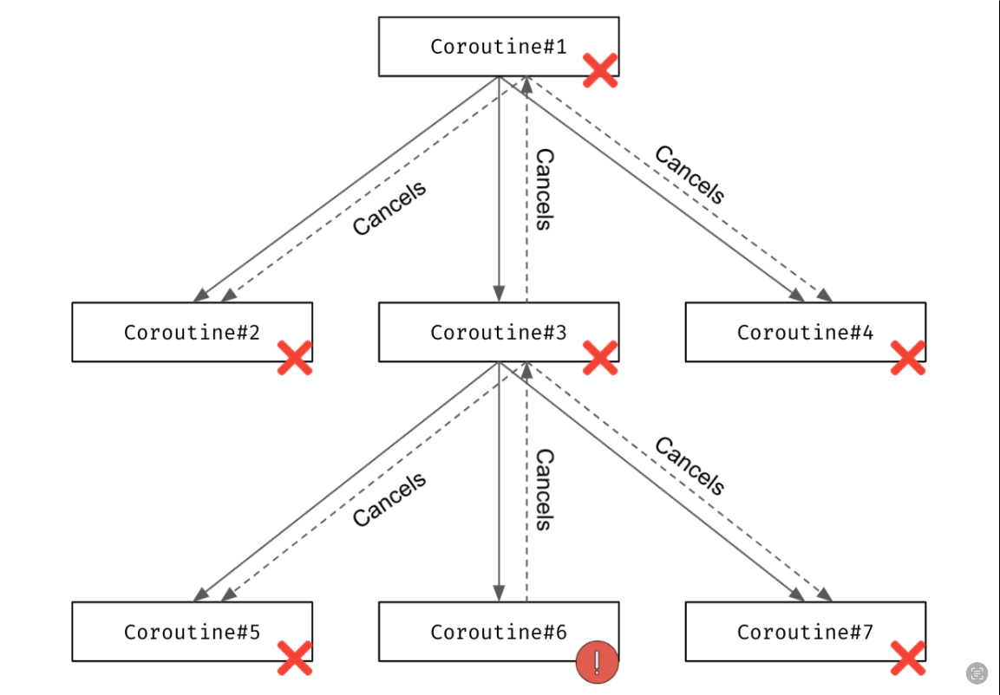
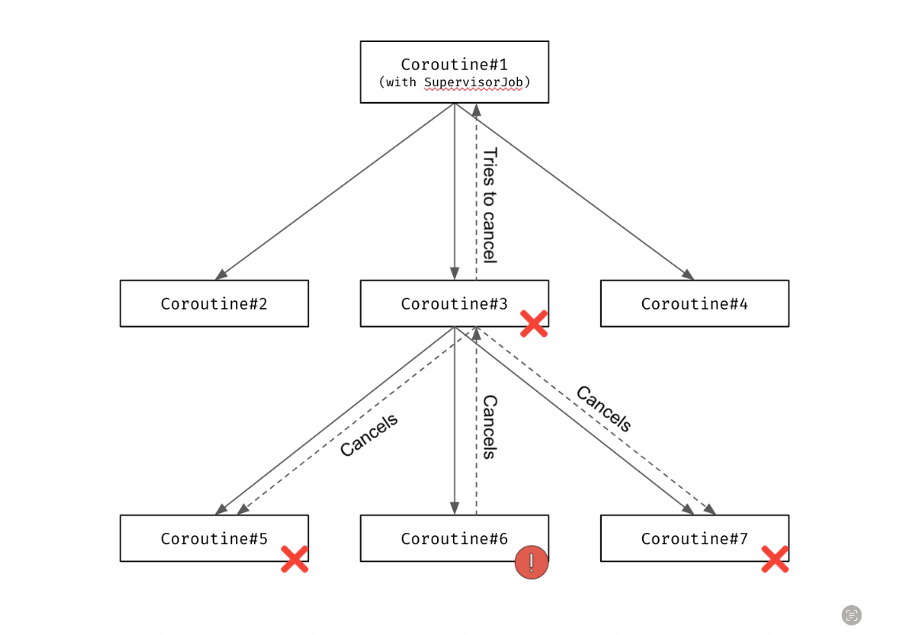

1. ##### **General**

    - A goroutine is a lightweight thread managed by the Go runtime. It's fully supported by Golang SDK. Go runtime takes complete control of scheduling goroutines and we don't have to think about it all.
    - Kotlin coroutine is an instance of a suspendable computation. It is conceptually similar to a thread, in the sense that it takes a block of code to run that works concurrently with the rest of the code. However, a coroutine is not bound to any particular thread.  With Kotlin coroutines you have fine-grained control on the execution environment of your coroutines. Kotlin coroutines contains built-in support provided by the Kotlin language (compiler support and elements in the Kotlin standard library), and the Kotlin Coroutines library (named **kotlinx.coroutines**)

      Built-in language support contains only basic elements(Eg: **Continuation**, **SuspendCoroutine**, ...) and mainly use by library creators
      
      **kotlinx.coroutines** library build on top of Built-in language support. It provides many elements (Eg: launch, async, Deferred, ...) and mainly us by application developer
2. ##### Scheduling policy
    With Kotlin coroutine, we can customize the scheduling strategy by specifying a Dispatcher. Because Kotlin support multiplatform so list of **Dispatcher** depends on the platform we are using. The default scheduler for Kotlin/JVM is `CoroutineScheduler`
   **CoroutineScheduler** and goroutine scheduler are both using Work-stealing strategy. Each worker has a local queue in addition to a global queue. Work-stealing strategy is implemented over that queues to provide even load distribution and illusion of centralized run queue.

   When start a coroutine, CoroutineScheduler try to add task to local queue first, then global queue. When finding task to execute: 
   - The worker get a random value from `[0,2*corePoolSize)` (1/(2*corePoolSize) of the time). If this value = 0, the worker will pick task from global queue. Each dispatcher has one specific value of corePoolSize. Eg: **Dispatchers.Default** has `corePoolSize=min(numberOfCpuCores, 2)` and Dispatchers.IO has `corePoolSize=min(64, numberOfCpuCores)`
   - Otherwise, the worker will pick task from local queue
   - Or poll tasks from global queue
   - Or try to steal task from other workers.
   - Or find blocking task from global blocking queue

   On the other hand, goroutine scheduler will push the task to global queue. These tasks will be assigned to processor local queue when it is ready to execute. When finding task to execute:
   - The processor check for task from  the global queue 1/61 of the time.
   - Then the processor find a task in the local queue. 
   - Or polls tasks from global queue.
   - Or polls tasks from network queue
   - Or steals task from other processor.
    
3. ##### **Structured concurrency**
    Kotlin coroutine supports parent-child relationship and go routine does not. A parent provides a scope for its children, and they are called in this scope. This relationship called **Structured Concurrency**. There are some effects from **Structured Concurrency**:
    
    -  Children inherit  context from their parent
    -  A parent suspends until all the children are finished
    -  When the parent is cancelled, its child coroutines are cancelled too
    -  When a child raises an error, it destroys the parent as well
   ```kotlin
        suspend fun main() = coroutineScope {
            val job = launch {
                launch{
                    delay(500)
                    println("Will be printed")
                }
                launch{
                    delay(2000)
                    println("Will not be printed")
                }
            }
            delay(1000)
            job.cancelAndJoin()
        }
   ```
   The result will be:
   ```
    Will be printed
   ```
   What if we replace `delay(2000)` with `Thread.sleep(2000)`. The result will be:
   ```
    Will be printed
    Will not be printed
   ```
   This is because of Kotlin coroutine cancels at the first suspension point
4. ##### Error handling

   Because of **Structured Concurrency** , once Kotlin coroutine received an exception, it canceled itself and propagates the exception to its parent. The parent cancel itself and all its children.
   
   

   We can stop the exception propagation by using **SupervisorJob**. The parent will ignore error from its children.
   
   

   We can also implement default exception handler by using special **CoroutineContext** called **CoroutineExceptionHandler**. The default behavior of **CoroutineExceptionHandler** is printing the exception stacktrace. **Note that the CoroutineExceptionHandler doesn't stop the exception propagation**.
    
   By default, Golang use error value to indicate an abnormal state, so we have to handle the exception manually when working with goroutine. We can use an error channel to communicate between coroutines and its parent or use `context.WithCancel()`
    ```
    package main

    import (
      "context"
      "fmt"
      "time"
    )
    
    func main() {
      forever := make(chan struct{})
      ctx, cancel := context.WithCancel(context.Background())

      go func(ctx context.Context) {
        for {
            select {
            case <-ctx.Done():  // if cancel() execute
                forever <- struct{}{}
                return
            default:
                fmt.Println("for loop")
            }

            time.Sleep(500 * time.Millisecond)
        }
     }(ctx)

     go func() {
        time.Sleep(3 * time.Second)
        cancel()
     }()

     <-forever
     fmt.Println("finish")
   }
    ```